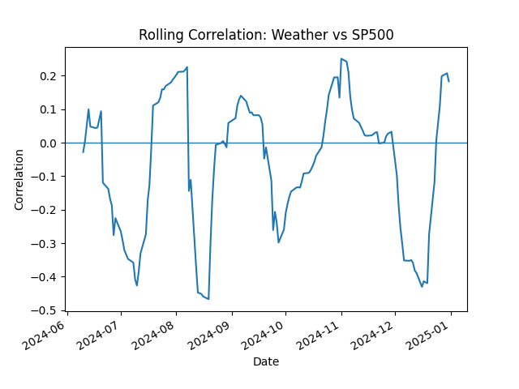
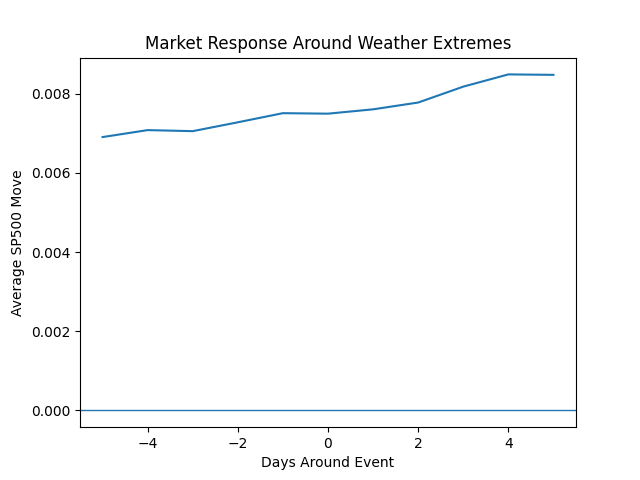

# SignalLab

SignalLab is an experimental data pipeline for exploring relationships between market signals and external factors such as weather. It provides a modular framework for ingesting, transforming, and analyzing time-series signals with a focus on reproducibility and extensibility.

## Current Experiment

This first iteration explores:

- S&P 500 market movements
- Weather anomaly signals
- Lagged relationships
- Rolling correlation
- Event-based market response to weather extremes

## Example Outputs





## Getting Started

You can run SignalLab using either Conda or standard Python.

### Option A — Conda

```bash
conda create -n signal-lab python=3.11
conda activate signal-lab
pip install -e .
```

### Option B — Standard Python

```bash
python -m venv venv
```

Activate Windows environment:

```bash
venv\Scripts\activate
```

Activate macOS / Linux environment:

```bash
source venv/bin/activate
```

Install package and run:

```bash
pip install -e .
python scripts/run_pipeline.py
```

## Structure

- `data/` – raw and processed datasets
- `src/signal_lab/` – core pipeline and analysis code
- `scripts/` – execution entry points

## Notes

This is an early research prototype. Results are exploratory and not predictive.

---

## Future Directions

- Sector-level market analysis
- News sentiment integration
- Multi-region weather signals
- Event-based modeling improvements
